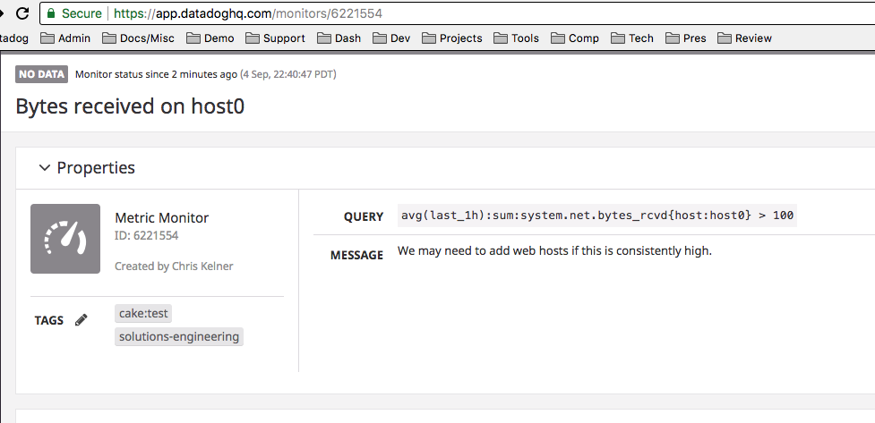

# Create Monitor
This script will create a `metric alert` monitor using `thresholds` as defined
in the
[Datadog API docs](https://docs.datadoghq.com/api/?lang=python#create-a-monitor)

# Run Code
- Setup a python virtualenv: `virtualenv create_monitor`
- Activate the virtualenv: `source create_monitor/bin/activate`
- Run `pip install -r requirements.txt`
- Run `python create_monitor.py -k <your-api-key> -a <your-app-key>`
  - Alternatively set `DATADOG_API_KEY` or `DD_API_KEY` and `DATADOG_APP_KEY` or
    `DD_APP_KEY` as environment variables (NOTE: It will need to be set WITHIN
    your virtualenv (e.g. after running step two here), see these docs for
    details:
    https://virtualenv.pypa.io/en/stable/reference/#environment-variables)
      - The `#kelnerhax` way is to cheat like so:
        `DATADOG_API_KEY=<secret> DATADOG_APP_KEY=<nuh-uh> python create_monitor.py`
- Result should be something like:o
```
Creating a test monitor
{
    "created": "2018-09-05T05:50:30.878346+00:00",
    "created_at": 1536126630000,
    "creator": {
        "email": "<redacted>@datadoghq.com",
        "handle": "<redacted>@datadoghq.com",
        "id": <redacted>,
        "name": "<redacted>"
    },
    "deleted": null,
    "id": 6221581,
    "message": "We may need to add web hosts if this is consistently high.",
    "modified": "2018-09-05T05:50:30.878346+00:00",
    "multi": false,
    "name": "Bytes received on host0",
    "options": {
        "evaluation_delay": 360,
        "locked": false,
        "new_host_delay": 300,
        "no_data_timeframe": 20,
        "notify_audit": false,
        "notify_no_data": true,
        "require_full_window": true,
        "silenced": {},
        "thresholds": {
            "critical": 100.0,
            "critical_recovery": 70.0,
            "warning": 80.0,
            "warning_recovery": 50.0
        }
    },
    "org_id": <redacted>,
    "overall_state": "No Data",
    "overall_state_modified": null,
    "query": "avg(last_1h):sum:system.net.bytes_rcvd{host:host0} > 100",
    "tags": [
        "cake:test",
        "solutions-engineering"
    ],
    "type": "query alert"
}
```

