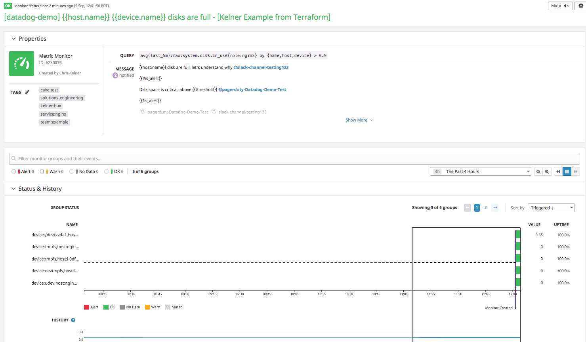

# Datadog Monitor Creation with Terraform
Monitoring as Code w/ Terraform &amp; Datadog example. This repo will create
monitoring resources using Terraform.

Be sure to watch this video of Atlassian presenting on their usage of Terraform
and Datadog: https://vimeo.com/237934245.

All terraform configuration can be found under the [`/terraform`](/terraform)
directory. Their is no hierarchy for this example, but typically you might
organize your terraform configuration in such a way that it gets broken into
re-usable modules (and potentially modules of modules) for common patterns
within your infrastructure.

In this example, modules and raw configuration are colocated into "groups"
respective of their function, e.g. `boilerplate.tf` will contain the necessary
configuration to configure terraform, while `monitoring.tf` will contain the
configuration to create Datadog resources, and so on.

__*This repo is only for example purposes.*__

If you are looking for examples that include infrastructure, please be sure to
check out the following:
- https://github.com/ckelner/terraform-datadog
- https://github.com/ckelner/terraform-intro-demo

# Noteworthy
- This repo does not use [Terraform
workspaces](https://www.terraform.io/docs/state/workspaces.html); it is a best
practice to use workspaces, this repo is only for example purposes.
- This repo does not use [Terraform remote
state](https://www.terraform.io/docs/state/remote.html); it is a best
practice to use remote state, this repo is only for example purposes.
- For monitoring definitions, see
[`./terraform/monitoring.tf`](./terraform/monitoring.tf)
- Monitors created through the Datadog API and Terraform have a specific syntax
that must include parameters for the critical threshold, e.g.
`avg(last_1h):sum:system.net.bytes_rcvd{host:host0} > 100` -- see more here:
https://www.terraform.io/docs/providers/datadog/r/monitor.html#query and here:
https://docs.datadoghq.com/api/?lang=python#create-a-monitor
  - Omitting or having this below the critical threshold will result in an error
  similar to this: `error updating monitor: API error 400 Bad Request: {"errors":["Critical threshold (0.9) does not match that used in the query (0.0)."]}`

# Use
## Setup
- Checkout this repository using git
- Change into the [`/terraform`](/terraform) directory on the command line
- Update variable values in [`/terraform/variables.tf`](/terraform/variables.tf)
to meet those required by your environment
- Define `DATADOG_API_KEY` and `DATADOG_APP_KEY` in environment variables per
the [Terraform
documentation](https://www.terraform.io/docs/providers/datadog/index.html)

## Init
Run `terraform init` - this will pull down all modules and setup your
local environment to get started with terraform. Output will look similar to the
example below (truncated in places):
```
Initializing modules...
- module.cpu_monitor
  Getting source "./datadog_metric_monitor_module"

Initializing provider plugins...
- Checking for available provider plugins on https://releases.hashicorp.com...
- Downloading plugin for provider "datadog" (1.2.0)...

The following providers do not have any version constraints in configuration,
so the latest version was installed.

To prevent automatic upgrades to new major versions that may contain breaking
changes, it is recommended to add version = "..." constraints to the
corresponding provider blocks in configuration, with the constraint strings
suggested below.

* provider.datadog: version = "~> 1.2"

Terraform has been successfully initialized!
```

# Plan
Run `terraform plan -out=plan.out` - this will provide you with a plan of what
terraform will change (commonly known as a "dry run"). The `-out` flag allows us
to save this plan to a file and use it when making the actual changes later. In
this way we can ensure that any local or remote changes that have occurred
between the time we ran `plan` and `apply` are not accepted.

An example of plan output (truncated in places):
```
Refreshing Terraform state in-memory prior to plan...
The refreshed state will be used to calculate this plan, but will not be
persisted to local or remote state storage.


------------------------------------------------------------------------

An execution plan has been generated and is shown below.
Resource actions are indicated with the following symbols:
  + create

Terraform will perform the following actions:

  + datadog_monitor.common_disk_full
      id:                           <computed>
      evaluation_delay:             "360"
      include_tags:                 "true"
      message:                      "{{host.name}} disk are full, let's understand why @slack-channel-testing123\n\n  {{#is_alert}}\n\n  Disk space is critical, above {{threshold}}\n  @pagerduty-Datadog-Demo-Test\n\n  {{/is_alert}}"
      name:                         "[datadog-demo] {{host.name}} {{device.name}} disks are full - [Kelner Example from Terraform]"
      new_host_delay:               <computed>
      no_data_timeframe:            "20"
      notify_no_data:               "false"
      query:                        "avg(last_5m):max:system.disk.in_use{role:nginx} by {name,host,device} > 0.9"
      require_full_window:          "true"
      tags.#:                       "5"
      tags.0:                       "cake:test"
      tags.1:                       "solutions-engineering"
      tags.2:                       "kelner:hax"
      tags.3:                       "service:nginx"
      tags.4:                       "team:example"
      thresholds.%:                 "4"
      thresholds.critical:          "0.9"
      thresholds.critical_recovery: "0.89"
      thresholds.warning:           "0.8"
      thresholds.warning_recovery:  "0.79"
      type:                         "metric alert"

  + module.cpu_monitor.datadog_monitor.metric_monitor
      id:                           <computed>
      evaluation_delay:             "360"
      include_tags:                 "true"
      message:                      "{{host.name}} w/ ip {{host.ip}} CPU is high!\n  CPU has been above {{threshold}} for the last 5 minutes!\n  @pagerduty-Datadog-Demo"
      name:                         "[datadog-demo] {{host.name}} CPU is {{value}} - [Kelner Example from Terraform]"
      new_host_delay:               <computed>
      no_data_timeframe:            "20"
      notify_no_data:               "false"
      query:                        "avg(last_5m):max:system.cpu.user{role:demo} by {host} >= 1"
      require_full_window:          "true"
      tags.#:                       "3"
      tags.0:                       "cake:test"
      tags.1:                       "solutions-engineering"
      tags.2:                       "kelner:hax"
      thresholds.%:                 "4"
      thresholds.critical:          "1"
      thresholds.critical_recovery: "0.97"
      thresholds.warning:           "0.95"
      thresholds.warning_recovery:  "0.9"
      type:                         "metric alert"


Plan: 2 to add, 0 to change, 0 to destroy.

------------------------------------------------------------------------

This plan was saved to: plan.out

To perform exactly these actions, run the following command to apply:
    terraform apply "plan.out"
```

# Apply
Run `terraform apply "plan.out"` to create or update your infrastructure. By
passing `"plan.out"` this will ensure that what you saw in your dry run is what
gets applied to real resources in your provider (Datadog) ignoring any local or
remote changes (which can result in failure if there is a mismatch, this can
help you prevent mistakes or collisions). Example output below w/ truncations:
```
module.cpu_monitor.datadog_monitor.metric_monitor: Creating...
  evaluation_delay:             "" => "360"
  include_tags:                 "" => "true"
  message:                      "" => "{{host.name}} w/ ip {{host.ip}} CPU is high!\n  CPU has been above {{threshold}} for the last 5 minutes!\n  @pagerduty-Datadog-Demo"
  name:                         "" => "[datadog-demo] {{host.name}} CPU is {{value}} - [Kelner Example from Terraform]"
  new_host_delay:               "" => "<computed>"
  no_data_timeframe:            "" => "20"
  notify_no_data:               "" => "false"
  query:                        "" => "avg(last_5m):max:system.cpu.user{role:demo} by {host} >= 1"
  require_full_window:          "" => "true"
  tags.#:                       "0" => "3"
  tags.0:                       "" => "cake:test"
  tags.1:                       "" => "solutions-engineering"
  tags.2:                       "" => "kelner:hax"
  thresholds.%:                 "0" => "4"
  thresholds.critical:          "" => "1"
  thresholds.critical_recovery: "" => "0.97"
  thresholds.warning:           "" => "0.95"
  thresholds.warning_recovery:  "" => "0.9"
  type:                         "" => "metric alert"
datadog_monitor.common_disk_full: Creating...
  evaluation_delay:             "" => "360"
  include_tags:                 "" => "true"
  message:                      "" => "{{host.name}} disk are full, let's understand why @slack-channel-testing123\n\n  {{#is_alert}}\n\n  Disk space is critical, above {{threshold}}\n  @pagerduty-Datadog-Demo-Test\n\n  {{/is_alert}}"
  name:                         "" => "[datadog-demo] {{host.name}} {{device.name}} disks are full - [Kelner Example from Terraform]"
  new_host_delay:               "" => "<computed>"
  no_data_timeframe:            "" => "20"
  notify_no_data:               "" => "false"
  query:                        "" => "avg(last_5m):max:system.disk.in_use{role:nginx} by {name,host,device} > 0.9"
  require_full_window:          "" => "true"
  tags.#:                       "0" => "5"
  tags.0:                       "" => "cake:test"
  tags.1:                       "" => "solutions-engineering"
  tags.2:                       "" => "kelner:hax"
  tags.3:                       "" => "service:nginx"
  tags.4:                       "" => "team:example"
  thresholds.%:                 "0" => "4"
  thresholds.critical:          "" => "0.9"
  thresholds.critical_recovery: "" => "0.89"
  thresholds.warning:           "" => "0.8"
  thresholds.warning_recovery:  "" => "0.79"
  type:                         "" => "metric alert"
datadog_monitor.common_disk_full: Creation complete after 0s (ID: 6230039)
module.cpu_monitor.datadog_monitor.metric_monitor: Creation complete after 0s (ID: 6230040)

Apply complete! Resources: 2 added, 0 changed, 0 destroyed.

Outputs:

datadog_common_disk_full_monitor_id = 6230039
datadog_cpu_high_module_monitor_id = 6230040
```

You can then take these IDs and open them in the Datadog UI:
- `https://app.datadoghq.com/monitors/<id from out>` replacing `<id from out>`
with the actual id at the end of the TF apply.

Example here:



# Destroy
Run `terraform destroy` to delete all your resources. Ideally you should, in a
best practices scenario, run a `plan -destroy -out=<file.out>` as described in
the [Terraform
docs](https://www.terraform.io/docs/commands/plan.html#destroy) to ensure you
do not destroy anything you intended to keep and then `apply` that plan.

Example output (truncated in places):
```
datadog_monitor.metric_monitor: Refreshing state... (ID: 6230040)
datadog_monitor.common_disk_full: Refreshing state... (ID: 6230039)

An execution plan has been generated and is shown below.
Resource actions are indicated with the following symbols:
  - destroy

Terraform will perform the following actions:

  - datadog_monitor.common_disk_full

  - module.cpu_monitor.datadog_monitor.metric_monitor


Plan: 0 to add, 0 to change, 2 to destroy.

Do you really want to destroy all resources?
  Terraform will destroy all your managed infrastructure, as shown above.
  There is no undo. Only 'yes' will be accepted to confirm.

  Enter a value: yes

module.cpu_monitor.datadog_monitor.metric_monitor: Destroying... (ID: 6230040)
datadog_monitor.common_disk_full: Destroying... (ID: 6230039)
module.cpu_monitor.datadog_monitor.metric_monitor: Destruction complete after 0s
datadog_monitor.common_disk_full: Destruction complete after 0s

Destroy complete! Resources: 2 destroyed.
```
