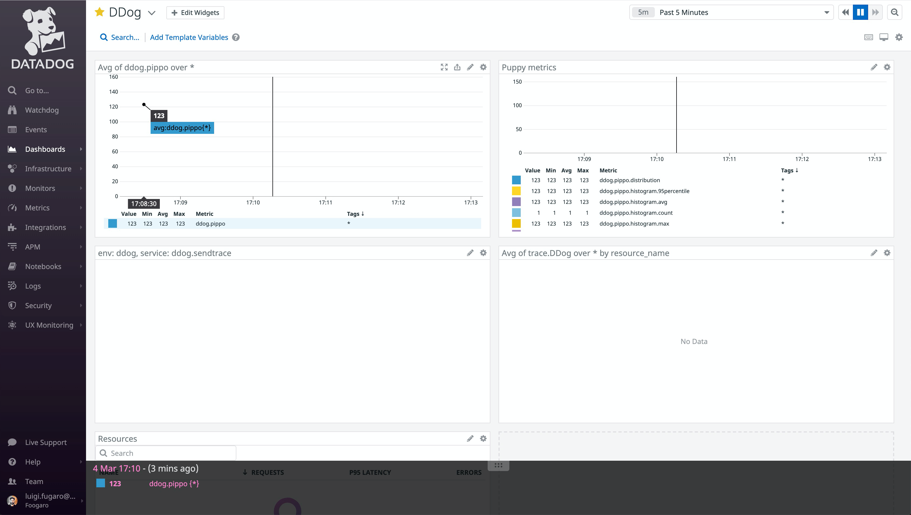
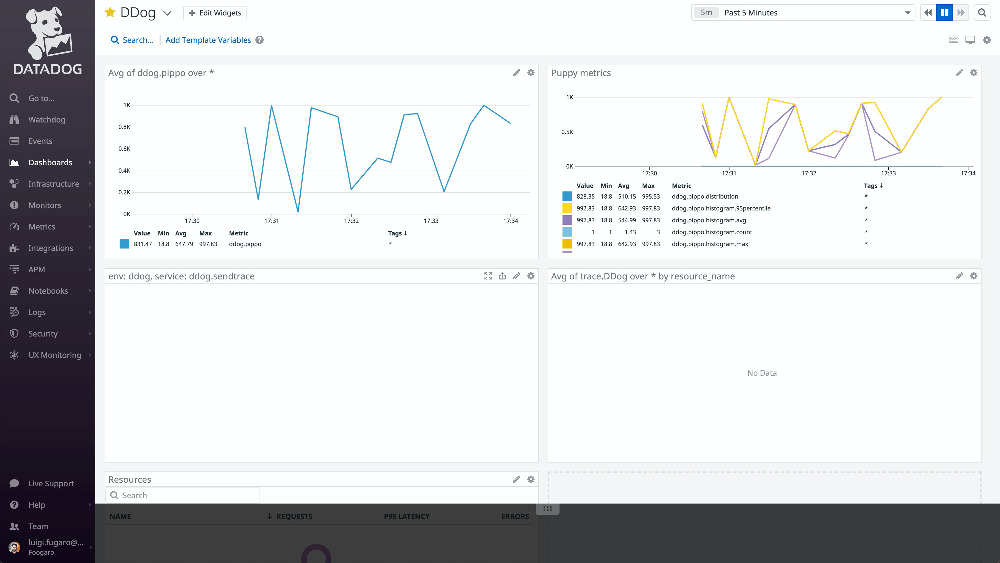
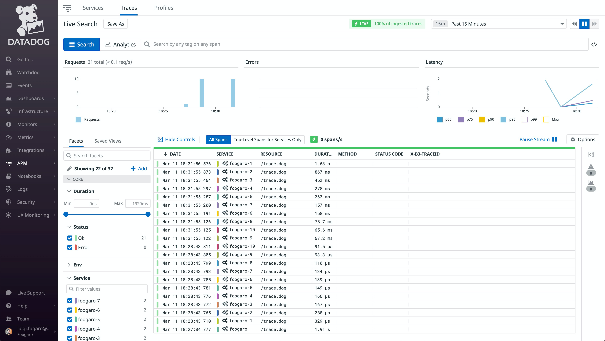
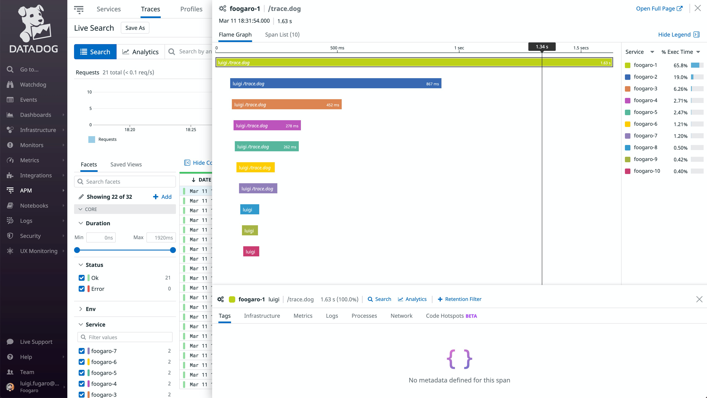
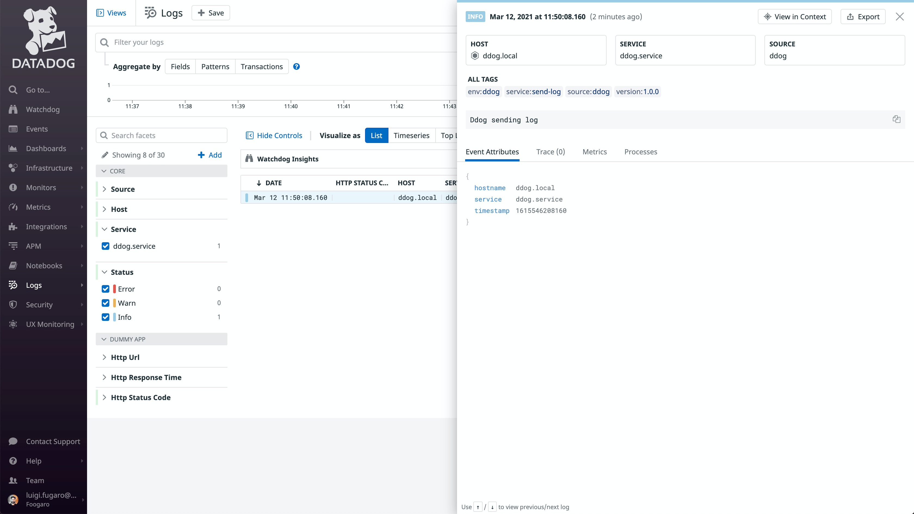
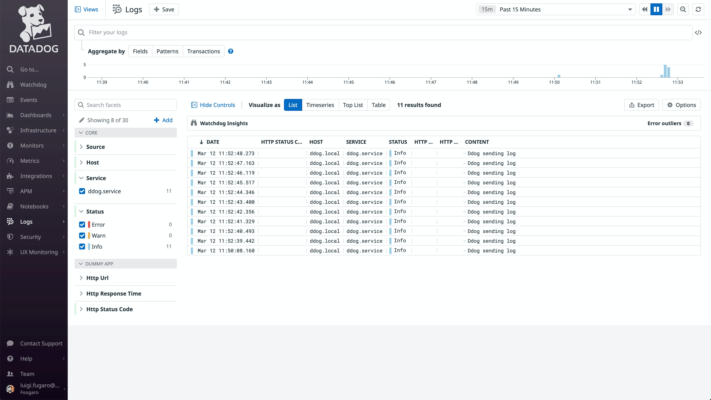

# DDog
DDog is yet another CLI tool written in Java to check connectivity towards the Datadog SaaS.

## Commands
Those are the commands that can be used:
* [ping](#ping)
* [send-metric](#sendmetric)
* [send-trace](#sendtrace)
* [send-log](#sendlog)

There is also a CLI help online:
```bash
./ddog
Missing required subcommand
Usage: ddog [COMMAND]
Used to check connectivity between servers.
Commands:
  send-metric  Send a metric.
  send-trace   Send a trace.
  send-log     Send a log event.
  ping         Used to check connectivity between servers.
```


## Ping
This command should be used to check in the on-premise environment if there are connectivity problems between servers (firewalls, etc).
The Ping command behaves like an echo server, where the _client-ping_ sends a text message to the _server-ping_ which in turn responds by reversing the text message.

### Hep online
```bash
./ddog ping -h
Usage: ddog ping [-hV] [--verbose] [--bind-address=<bindAddress>]
                 [--bind-port=<bindPort>] --message=<message> --mode=<mode>
                 [--target-host=<targetHost>] [--target-port=<targetPort>]
Used to check connectivity between servers.
      --bind-address=<bindAddress>
                            Bind address. Default is 0.0.0.0.
      --bind-port=<bindPort>
                            Server port. Default is 4405.
  -h, --help                Show this help message and exit.
      --message=<message>   The message to send over the wire.
      --mode=<mode>         The mode to be used: client or server.
      --target-host=<targetHost>
                            Target host:port pairs. Default is localhost.
      --target-port=<targetPort>
                            Target port. Default is 4405.
  -V, --version             Print version information and exit.
      --verbose             Verbose output of the command. Default is false.
```

### Client mode
The command for the Client mode is the following:
```bash
./ddog ping --mode=client --target-host=127.0.0.1 --target-port=4405 --message=ciao --verbose=true
```
Where:
* target-host must match the interface bound by the _server-ping_ instance.
* target-port must match the bind port of the _server-ping_ instance.

### Server mode
The command for the Server mode is the following:
```bash
./ddog ping --mode=server --bind-address=0.0.0.0 --bind-port=4405 --verbose=true
```
Where:
* bind-address matches an IP of one the available interface. Default is AnyInterface, which isolved by the IP 0.0.0.0.
* bind-port matches the port opened by the UDP socket.

### Example
#### Server instance
The command for the Server mode is the following:
```bash
./ddog ping --mode=server --bind-address=0.0.0.0 --bind-port=4405 --verbose=true
Parameters
        message: null
        mode: server
        bind-address: 0.0.0.0
        bind-port: 4405
        target-host: localhost
        target-port: 4405
        verbose: true
Server received message ciao
Server sending reverse response oaic
```

#### Client instance
```bash
./ddog ping --mode=client --target-host=127.0.0.1 --target-port=4405 --message=ciao --verbose=true
Parameters
        message: ciao
        mode: client
        bind-address: 0.0.0.0
        bind-port: 4405
        target-host: 127.0.0.1
        target-port: 4405
        verbose: true
Client sending message ciao to server
Client received response oaic
```

## SendMetric
This command should be used to check the connectivity between a server sending metrics to a remote server hosting the Datadog agent listening for metrics (port 8125), and the Datadog SaaS.

### Hep online
```bash
./ddog send-metric -h
Usage: ddog send-metric [-hV] [--verbose] [--host=<host>]
                        [--interval=<interval>] [--name=<name>] [--port=<port>]
                        [--size=<size>] [--tags=<tags>] [--value=<value>]
Send a metric.
  -h, --help            Show this help message and exit.
      --host=<host>     Datadog Agent host binding interface. Default is localhost.
      --interval=<interval>
                        Number of milliseconds to wait before sending the next metric. Default is 0..2000.
      --name=<name>     Name of the metric. Default is puppy. Prefixed by ddog.
      --port=<port>     Datadog Agent host listening port. Default is 8125.
      --size=<size>     Number of metric to send. Default is 1.
      --tags=<tags>     Tags use to group the metric. Defaults are: env:ddog,service:send-metric,version:1.0.0.
  -V, --version         Print version information and exit.
      --value=<value>   Value of the metric. Default is random 0..1000.
      --verbose         Verbose output of the command. Default is false.
```

### Prerequisite
To be able to run this command, there must be an agent up&running somewhere, listening on port 8125 for metrics to come, and with the Dogstatsd enabled.

To test it, you can use a Datadog agent running on a container as per the following (BYO api key):

```shell
docker run -d --rm \
-v /var/run/docker.sock:/var/run/docker.sock:ro \
-v /proc/:/host/proc/:ro \
-v /sys/fs/cgroup/:/host/sys/fs/cgroup:ro \
-e DD_API_KEY=${DD_API_KEY} \
-e DD_ENV=ddog \
-e DD_LOG_LEVEL=INFO \
-e DD_APM_ENABLED=true \
-e DD_APM_NON_LOCAL_TRAFFIC=true \
-e DD_DOGSTATSD_NON_LOCAL_TRAFFIC=true \
-e DD_TAGS=arch:docker \
--name=datadog-agent \
-p 127.0.0.1:8125:8125/udp \
-p 127.0.0.1:8126:8126/tcp \
datadog/agent:latest
a41b35575168c4cbdc6dcfd1fcf63a3b6942de740e84a1b33b6b7c4a4b698528

docker ps
CONTAINER ID   IMAGE                  COMMAND   CREATED         STATUS                           PORTS                                                NAMES
a41b35575168   datadog/agent:latest   "/init"   3 seconds ago   Up 1 second (health: starting)   127.0.0.1:8125->8125/udp, 127.0.0.1:8126->8126/tcp   datadog-agent
```

Once the Agent is up&running, the command can be invoked.

### Example
Here it follows an example sending one metric named _pippo_ with value _123_.

```shell
./ddog send-metric --name=pippo --value=123 --verbose=true
Tags:
	env:ddog,service:send-metric,version:1.0.0
Parameters
	name: pippo
	value: 123.0
	host: localhost
	port: 8125
	tags: env:ddog,service:send-metric,version:1.0.0
	size: 1
	interval: 2000
	verbose: true
Sending metric ddog.pippo=123.0
```

And the metric can be seen after few seconds on a dashboard:



Here it follows an example sending 100 metrics named _pippo_ with values between 0 and 1_000 with an interval between 1 and 20_000 milliseconds from each other.
```shell
./ddog send-metric --name=pippo --size=100 --interval=20000 --verbose=true
Tags:
	env:ddog,service:send-metric,version:1.0.0
Parameters
	name: pippo
	value: 0.0
	host: localhost
	port: 8125
	tags: env:ddog,service:send-metric,version:1.0.0
	size: 100
	interval: 20000
	verbose: true
Sending metric [1/100] ddog.pippo=908.3492678502207
Sending metric [2/100] ddog.pippo=73.21617609151765
Sending metric [3/100] ddog.pippo=792.7988277656299
Sending metric [4/100] ddog.pippo=132.48341323285018
Sending metric [5/100] ddog.pippo=995.5312027899873
	(more)
Sending metric [96/100] ddog.pippo=587.5101823308463
Sending metric [97/100] ddog.pippo=597.9512893309977
Sending metric [98/100] ddog.pippo=355.64462675926836
Sending metric [99/100] ddog.pippo=453.27309288167675
Sending metric [100/100] ddog.pippo=124.50832068461392
```

And the metrics coming can be seen after few seconds on a dashboard:




## SendTrace
This command should be used to check the connectivity between a server sending metrics to a remote server hosting the Datadog agent listening for traces (port 8126), and the Datadog SaaS.

### Hep online
```bash
./ddog send-trace -h
Usage: ddog send-trace [-hV] [--hierarchical] [--verbose]
                       [--duration=<duration>] [--host=<host>]
                       [--interval=<interval>] [--port=<port>]
                       [--resource=<resource>] [--service=<service>]
                       [--size=<size>] [--span=<span>] [--span-id=<spanId>]
                       [--start=<start>] [--trace-id=<traceId>]
Send a trace.
      --duration=<duration>  Duration of the trace in nanoseconds (ns) (1s=1000ms=1000000μs=1000000000ns).
  -h, --help                 Show this help message and exit.
      --hierarchical         Datadog Agent host listening port. Default is false.
      --host=<host>          Datadog Agent host binding interface.
      --interval=<interval>  Number of milliseconds to wait before sending the next trace. Default is 0..2000 (two thousands).
      --port=<port>          Datadog Agent host listening port.
      --resource=<resource>  Name of the resource requested.
      --service=<service>    Name of the service/app.
      --size=<size>          Number of traces to send. Default is 1 (one)
      --span=<span>          Name of the trace
      --span-id=<spanId>     SpanID identifying the span.
      --start=<start>        Timestamp of the start of the trace in milliseconds since epoch.
      --trace-id=<traceId>   TraceID identifying the trace.
  -V, --version              Print version information and exit.
      --verbose              Verbose output of the command. Default is false.
```

### Prerequisite
To be able to run this command, there must be an agent up&running somewhere, listening on port 8126 for traces to come, and with the APM enabled.

To test it, you can use a Datadog agent running on a container as per the following (BYO api key):

```shell
docker run -d --rm \
-v /var/run/docker.sock:/var/run/docker.sock:ro \
-v /proc/:/host/proc/:ro \
-v /sys/fs/cgroup/:/host/sys/fs/cgroup:ro \
-e DD_API_KEY=${DD_API_KEY} \
-e DD_ENV=ddog \
-e DD_LOG_LEVEL=INFO \
-e DD_APM_ENABLED=true \
-e DD_APM_NON_LOCAL_TRAFFIC=true \
-e DD_DOGSTATSD_NON_LOCAL_TRAFFIC=true \
-e DD_TAGS=arch:docker \
--name=datadog-agent \
-p 127.0.0.1:8125:8125/udp \
-p 127.0.0.1:8126:8126/tcp \
datadog/agent:latest
a41b35575168c4cbdc6dcfd1fcf63a3b6942de740e84a1b33b6b7c4a4b698528

docker ps
CONTAINER ID   IMAGE                  COMMAND   CREATED         STATUS                           PORTS                                                NAMES
a41b35575168   datadog/agent:latest   "/init"   3 seconds ago   Up 1 second (health: starting)   127.0.0.1:8125->8125/udp, 127.0.0.1:8126->8126/tcp   datadog-agent
```

Once the Agent is up&running, the command can be invoked.

### Example
Here it follows an example sending one trace named _pippo_ with value _123_.

```shell
./ddog send-trace --size=1 --verbose=true --service=foogaro --span=luigi
Parameters
        span: luigi
        span-id: 1055376304
        resource: /trace.dog
        service: foogaro
        trace-id: 1866212021
        duration: 1907722802
        start: 1615483622869
        host: localhost
        port: 8126
        size: 1
        interval: 776
        hierarchical: true
        verbose: true
Sending trace [1/1]     http://localhost:8126/v0.3/traces
        {"duration":1907722802,"name":"luigi","resource":"/trace.dog","service":"foogaro","span_id":1055376304,"start":1615483622870000000,"trace_id":1866212021}
        http[200]
```

And the trace can be seen after few seconds on APM Traces page:


Here it follows an example sending 10 traces with 10 spans.

```shell
./ddog send-trace --size=10 --hierarchical=true --interval=100 --verbose=true --service=foogaro --span=luigi
Parameters
        span: luigi
        span-id: 257327151
        resource: /trace.dog
        service: foogaro
        trace-id: 2031155515
        duration: 1631634400
        start: 1615483914944
        host: localhost
        port: 8126
        size: 10
        interval: 100
        hierarchical: true
        verbose: true
Sending trace [1/10]
        http://localhost:8126/v0.3/traces
        {"duration":1631634400,"name":"luigi","resource":"/trace.dog","service":"foogaro-1","span_id":459689050,"start":1615483914945000000,"trace_id":2031155515}
        http[200]
Sending trace [2/10]
        http://localhost:8126/v0.3/traces
        {"duration":866897316,"name":"luigi","resource":"/trace.dog","service":"foogaro-2","span_id":1798074822,"start":1615483915007000000,"trace_id":2031155515}
        http[200]
Sending trace [3/10]
        http://localhost:8126/v0.3/traces
        {"duration":451802580,"name":"luigi","resource":"/trace.dog","service":"foogaro-3","span_id":2140231942,"start":1615483915013000000,"trace_id":2031155515}
        http[200]
Sending trace [4/10]
        http://localhost:8126/v0.3/traces
        {"duration":277882282,"name":"luigi","resource":"/trace.dog","service":"foogaro-4","span_id":1160998659,"start":1615483915020000000,"trace_id":2031155515}
        http[200]
Sending trace [5/10]
        http://localhost:8126/v0.3/traces
        {"duration":262468662,"name":"luigi","resource":"/trace.dog","service":"foogaro-5","span_id":1146668492,"start":1615483915025000000,"trace_id":2031155515}
        http[200]
Sending trace [6/10]
        http://localhost:8126/v0.3/traces
        {"duration":158375542,"name":"luigi","resource":"/trace.dog","service":"foogaro-6","span_id":736490571,"start":1615483915033000000,"trace_id":2031155515}
        http[200]
Sending trace [7/10]
        http://localhost:8126/v0.3/traces
        {"duration":157247453,"name":"luigi","resource":"/trace.dog","service":"foogaro-7","span_id":947022586,"start":1615483915043000000,"trace_id":2031155515}
        http[200]
Sending trace [8/10]
        http://localhost:8126/v0.3/traces
        {"duration":78720097,"name":"luigi","resource":"/trace.dog","service":"foogaro-8","span_id":1019464845,"start":1615483915048000000,"trace_id":2031155515}
        http[200]
Sending trace [9/10]
        http://localhost:8126/v0.3/traces
        {"duration":67200207,"name":"luigi","resource":"/trace.dog","service":"foogaro-9","span_id":1958152190,"start":1615483915055000000,"trace_id":2031155515}
        http[200]
Sending trace [10/10]
        http://localhost:8126/v0.3/traces
        {"duration":65635779,"name":"luigi","resource":"/trace.dog","service":"foogaro-10","span_id":1393527488,"start":1615483915060000000,"trace_id":2031155515}
        http[200]
```

And the traces and the spans can be seen after few seconds on APM Traces page:






## SendLog
This command should be used to check the connectivity between a server sending metrics to a remote server hosting the Datadog agent listening for metrics (port 8125), and the Datadog SaaS.

### Hep online
```bash
./ddog send-log -h
Usage: ddog send-log [-hV] [--verbose] --apiKey=<apiKey> [--content=<content>]
                     [--content-type=<contentType>] [--interval=<interval>]
                     [--size=<size>] [--tags=<tags>] [--url=<url>]
Send a log event.
      --apiKey=<apiKey>     The Datadog API KEY used to consume the Datadog API to send the log to.
      --content=<content>   Content of the log event. Default is a text message: "Ddog sending log".
      --content-type=<contentType>
                            Content type of the log. Default is "application/json".
  -h, --help                Show this help message and exit.
      --interval=<interval> Number of milliseconds to wait before sending the next log event. Default is 0..600.
      --size=<size>         Number of logs to send. Default is 1.
      --tags=<tags>         Tags use to identify the log. Defaults are: env:ddog,service:send-log,version:1.0.0.
      --url=<url>           The endpoint of the Datadog API to send the log to. Default is "https://http-intake.logs.datadoghq.com/v1/input".
  -V, --version             Print version information and exit.
      --verbose             Verbose output of the command. Default is false.
```

### Example
Here it follows an example sending one log event named.

```shell
./ddog send-log --apiKey=${DD_API_KEY} --size=1 --verbose=true
Parameters
        apiKey: <secret>
        content: Ddog sending log
        contentType: application/json
        url: https://http-intake.logs.datadoghq.com/v1/input
        tags: env:ddog,service:send-log,version:1.0.0
        size: 1
        interval: 600
        verbose: true
Sending log
        url: https://http-intake.logs.datadoghq.com/v1/input
        contentType: application/json
        log: {"message":"Ddog sending log","ddsource":"ddog","ddtags":"env:ddog,service:send-log,version:1.0.0","hostname":"ddog.local","service":"ddog.service","timestamp":"1615546208160"}
        response:
        HttpResponseProxy{HTTP/1.1 200 OK [Date: Fri, 12 Mar 2021 10:50:08 GMT, Content-Type: application/json, Content-Length: 2, Connection: keep-alive] ResponseEntityProxy{[Content-Type: application/json,Content-Length: 2,Chunked: false]}}
        http[200]
```

And the log event can be seen after few seconds on Log page:



Here it follows an example sending 10 log events.

```shell
./ddog send-log --apiKey=${DD_API_KEY} --size=10 --verbose=true
Parameters
        apiKey: <secret>
        content: Ddog sending log
        contentType: application/json
        url: https://http-intake.logs.datadoghq.com/v1/input
        tags: env:ddog,service:send-log,version:1.0.0
        size: 10
        interval: 600
        verbose: true
Sending log
        url: https://http-intake.logs.datadoghq.com/v1/input
        contentType: application/json
        log: {"message":"Ddog sending log","ddsource":"ddog","ddtags":"env:ddog,service:send-log,version:1.0.0","hostname":"ddog.local","service":"ddog.service","timestamp":"1615546359442"}
        response:
        HttpResponseProxy{HTTP/1.1 200 OK [Date: Fri, 12 Mar 2021 10:52:40 GMT, Content-Type: application/json, Content-Length: 2, Connection: keep-alive] ResponseEntityProxy{[Content-Type: application/json,Content-Length: 2,Chunked: false]}}
        http[200]
(more)
```

And the log events can be seen after few seconds on Log page:




