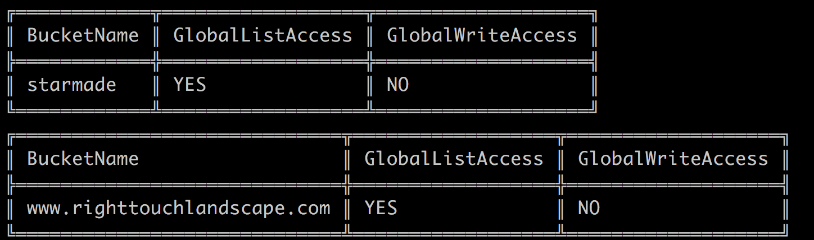

# S3 Permissions
This script will check S3 bucket ACL permissions for read/write access for
`AllUser` and report a metric to Datadog that uses a custom value to alert on.
This script uses `0` when no read or write ACLs are in place, `1` when read or
write is given to all users, and `2` when read and write are given to all users.

Bucket ACLs are only one vector in which you can expose your bucket, so I would
suggest using this only as an example of how you can combine the AWS APIs and
the Datadog API to send custom metrics. I highly suggest consulting AWS as to
attack/exposure vectors and how to query those via a programmatic means.

This script is just for POC and demostration purposes and should not be used for
production. It may be the basis for production monitoring scripts of your own.

This script could stand to be enhanced with resources such as:
- http://docs.aws.amazon.com/awssupport/latest/APIReference/API_DescribeTrustedAdvisorChecks.html
- http://boto3.readthedocs.io/en/latest/reference/services/support.html

These would give additional datapoints that could be alerted on.

Metrics in datadog based on this code look like:

And the code output will show which buckets are exposed:

# Run Code
- Setup a python virtualenv: `virtualenv s3_permissions`
- Activate the virtualenv: `source s3_permissions/bin/activate`
- Run `pip install -r requirements.txt`
- Setup [AWS Credentials](http://boto3.readthedocs.io/en/latest/guide/configuration.html)
  in your environment
- Run `python s3_permissions.py -k <your-api-key> -a <your-app-key>`
  - Alternatively set `DATADOG_API_KEY` or `DD_API_KEY` and `DATADOG_APP_KEY` or
    `DD_APP_KEY` as environment variables
